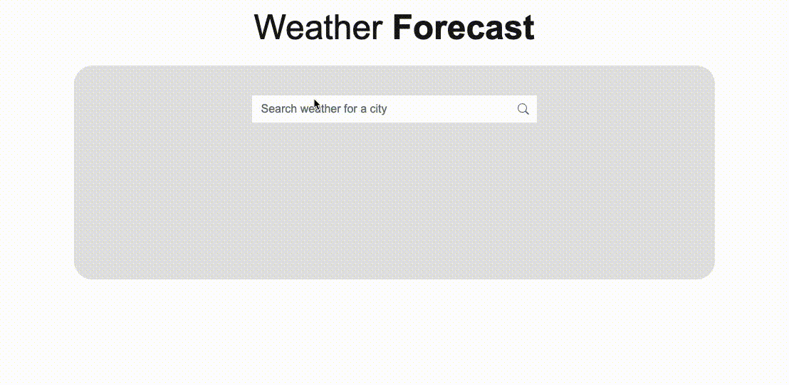
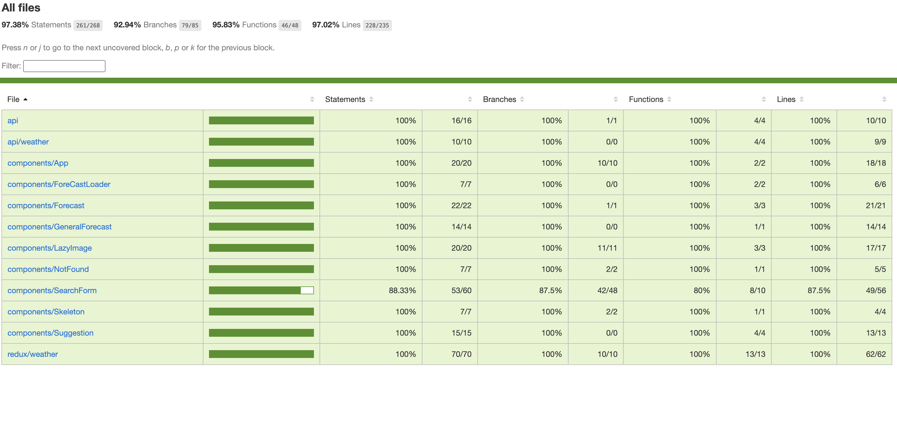

# Weather App

# 

<div align="center">
  <a href="https://codeclimate.com/github/chauduong1192/weather-app/maintainability">
    
  </a>
  
  <a href="https://codecov.io/gh/chauduong1192/weather-app">
    
  </a>
</div>

The source code using typescript, reactjs, redux, jest, bootstrap 5

## Links

- [Link Demo](https://chauduong1192.github.io/weather-app/)

## Coverage

# 

## Folder Structure

```
├── __tests__
├── public
├── src
    └── api
    └── assets
        └── images
        └── styles
    └── components
    └── redux
    └── utils
├── package.json
...
```

## Environment Variables

See `.env.example` for development defaults.

| Variable                        | Notes                     | Default value                                    |
| ------------------------------- | ------------------------- | ------------------------------------------------ |
| `REACT_APP_METAWEATHER_API_URL` | Meta weather api url      | https://www.metaweather.com/api                  |
| `REACT_APP_CROSS_DOMAIN`        | Cross-origin requests URL | https://the-ultimate-api-challenge.herokuapp.com |
| `REACT_APP_IMAGE_PATH`          | Meta weather image url    | https://www.metaweather.com/static/img/weather   |

## Prerequisites

[NodeJS](htps://nodejs.org), version >= 16.0.0 ( Try to use this one [`nvm`](https://github.com/creationix/nvm) to easy manage Node versions — `brew install nvm`.)

In the project directory, copy `.env.example` and rename the file just has copied to `.env.local`

## Install

```sh
yarn install
```

## Usage

### Run the app

```sh
yarn start
```

Open http://localhost:3000 to view it in the browser.

### Run unit test

```sh
yarn test
```

### Run Linter

```sh
yarn lint
```

### Build app and deploy to production

```sh
yarn build
```

### Redux dev tools

_Add details of how to access the app from within Chrome_

To view the state in the app install [the Redux dev tools Chrome plugin](https://chrome.google.com/webstore/detail/remotedev/faicmgpfiaijcedapokpbdejaodbelph/related).

## Author

👤 **Chau Duong**

- GitHub: [@chauduong1192](https://github.com/chauduong1192)
- LinkedIn: [LinkedIn](https://www.linkedin.com/in/chauduong1192/)
- Website: [chauduong.xyz](https://chauduong.xyz)

## Question and Issues

(https://github.com/chauduong1192/weather-app/issues)
